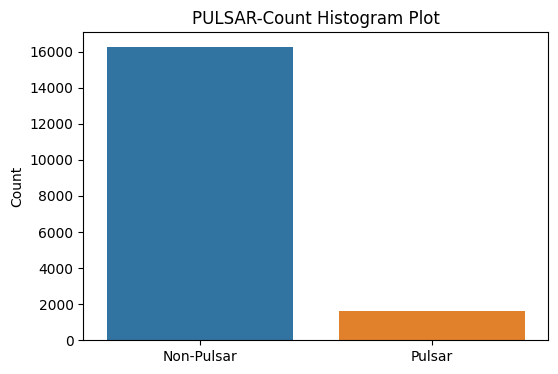
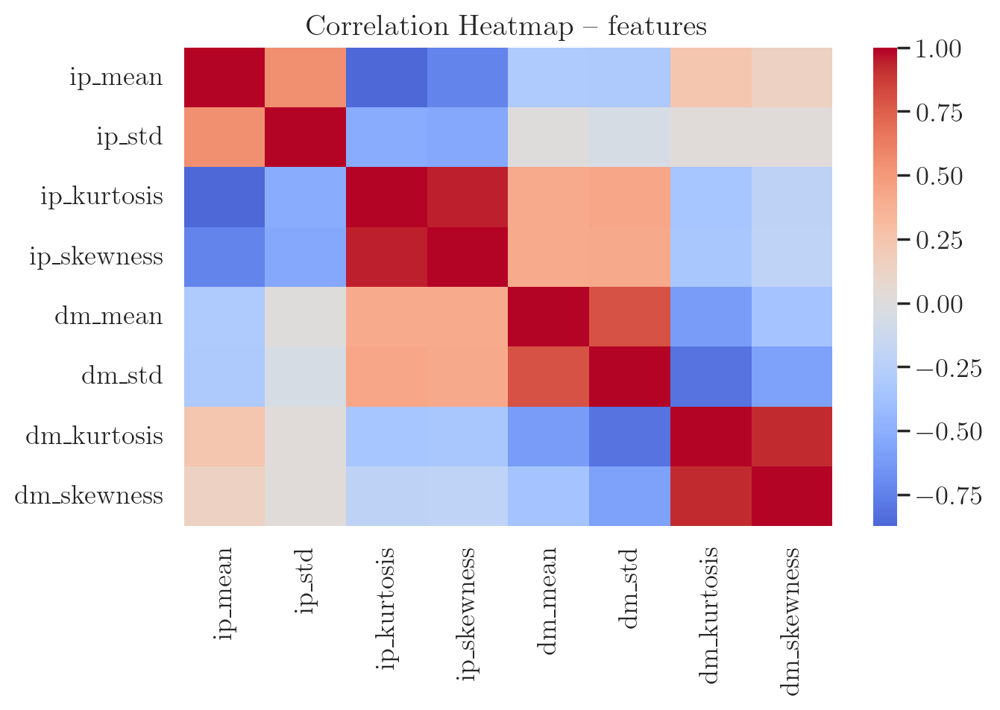
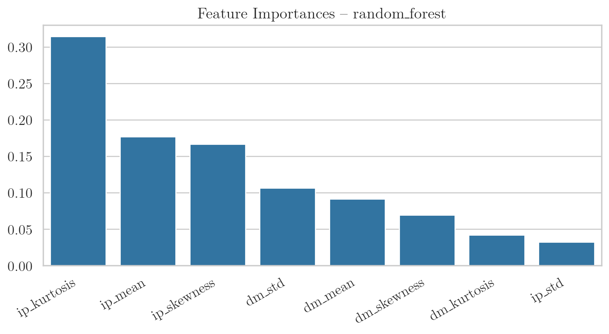

# 🌌 Pulsar Star Classification Project

A complete end-to-end machine learning pipeline for **classifying pulsar stars** using the **HTRU2 dataset**.
Includes automated data processing, model training, evaluation, comparison plots, and optional deployment via FastAPI.

---

## 📋 Table of Contents

* [Project Overview](#-project-overview)
* [Quick Start](#-quick-start)
  * [Prerequisites](#prerequisites)
  * [Installation](#installation)
  * [Makefile Commands](#makefile-commands)
* [Usage](#usage)
* [Project Structure](#project-structure)
* [Features](#-features)
* [Configuration](#configuration)
* [Model Performance](#-model-performance)
* [Deployment](#-model-deployment)
* [Troubleshooting](#-troubleshooting)
* [References](#-references)
* [License](#-license)
* [Contributing](#-contributing)

---

## 📋 Project Overview

This project focuses on classifying pulsar stars using the HTRU2 dataset from Kaggle. Pulsars are rare and valuable astronomical objects, and accurate classification is crucial for astronomical research. The project implements a complete machine learning pipeline from data acquisition to model deployment.

### 🎯 Business Problem

Pulsars are rare neutron stars that produce valuable scientific data. Manual classification is time-consuming and prone to error. This project aims to automate pulsar classification using machine learning to assist astronomers in identifying genuine pulsar signals from noise.

### 📊 Dataset

* **Source**: [HTRU2 Dataset from Kaggle](https://www.kaggle.com/datasets/charitarth/pulsar-dataset-htru2)
* **Samples**: 17,898 total instances
* **Features**: 8 numerical features derived from pulsar candidate profiles
* **Target**: Binary classification (0 = non-pulsar, 1 = pulsar)
* **Class Distribution**: Highly imbalanced (~90.84% non-pulsars, ~9.16% pulsars)



### Dataset Features

The HTRU2 dataset contains 8 features derived from the integrated pulse profile and DM-SNR curve:



1. **Integrated Profile Features**:
   * `ip_mean`: Mean of the integrated profile
   * `ip_std`: Standard deviation of the integrated profile
   * `ip_kurtosis`: Kurtosis of the integrated profile
   * `ip_skewness`: Skewness of the integrated profile

2. **DM-SNR Curve Features**:
   * `dm_mean`: Mean of the DM-SNR curve
   * `dm_std`: Standard deviation of the DM-SNR curve
   * `dm_kurtosis`: Kurtosis of the DM-SNR curve
   * `dm_skewness`: Skewness of the DM-SNR curve

3. **Target**:
   * `signal`: Class label (0: noise, 1: pulsar)

---

## 🚀 Quick Start

## Prerequisites

* Python **3.10+**
* **uv** package manager
  [https://docs.astral.sh/uv/](https://docs.astral.sh/uv/)
* Kaggle API credentials (`~/.kaggle/kaggle.json`)

## Installation

Clone the repository:

```bash
git clone git@github.com:mchadolias/pulsar-classification.git
cd pulsar-classification
```

### Set up Kaggle API

```bash
mkdir -p ~/.kaggle
cp kaggle.json ~/.kaggle/
chmod 600 ~/.kaggle/kaggle.json
```

### Install dependencies via uv

```bash
# Core dependencies
uv sync

# Development tools
uv sync --extra dev

# Training dependencies
uv sync --extra training

# Everything (recommended)
uv sync --extra dev --extra training
```

### Create data directories

```bash
uv run python scripts/setup_directories.py
```

## Makefile Commands

This project includes a self-documented Makefile.
Run:

```bash
make help
```

## Common commands

| Command                 | Description                                                     |
| ----------------------- | --------------------------------------------------------------- |
| `make train`            | Run full ML pipeline (download → preprocess → train → evaluate) |
| `make train-test`       | Run minimal full ML pipeline  (download → preprocess → train → evaluate) |
| `make plot`             | Generate all comparison plots (PNG + PDF)                       |
| `make plot-pdf`         | Only PDF comparison report                                      |
| `make plot-png`         | Only PNG comparison plots                                       |
| `make data`             | Set up directories and run a dry-run pipeline                   |
| `make clean`            | Remove Python caches                                            |
| `make clean-outputs`    | Remove models, metrics, and plots                               |
| `make install-all`     | Install all dependencies                                  |
| `make install-dev`      | Install development dependencies                                |
| `make install-training` | Install training dependencies                                   |

## Usage

### Full training pipeline

```bash
make train
```

### Generate comparison plots *without re-training*

```bash
make plot
```

---

## Project Structure

```text
pulsar-classification/
├── configs/                         # TOML configuration files
│   ├── model.toml                   # Main model and training configuration
│   └── test_model.toml              # Lightweight config for test/debug runs
├── data/
│   ├── external/                    # Raw data downloaded from Kaggle
│   └── processed/                   # Cleaned & split dataset used for training
├── deployment/
│   ├── client.py                    # CLI client for sending API prediction requests
│   ├── deploy_to_hf.sh              # Helper script for pushing to Hugging Face Spaces
│   ├── predict.py                   # Local FastAPI prediction app
│   ├── examples/                    # Example prediction payloads for testing the API
│   │   ├── batch_prediction.json
│   │   ├── single_prediction.json
│   │   └── test_cases.json
│   └── huggingface-space/           # Full deployable Hugging Face Space
│       ├── app.py                   # Main application entrypoint for HF Space
│       ├── deployment/predict.py    # HF-specific prediction wrapper
│       ├── Dockerfile               # HF container specification
│       ├── models/                  # Prepackaged model for Space execution
│       ├── README.md
│       └── requirements.txt
├── docs/
│   ├── DEPLOYMENT.md                # Instructions for Docker/HF deployment
│   └── MODEL_PERFOMANCE.md          # Detailed model performance report
├── logs/                            # Logs generated during pipeline execution
├── notebooks/
│   ├── 01_data_exploration.ipynb    # Exploratory data analysis notebook
│   └── 02_kaggle_submission.ipynb   # Notebook used for Kaggle submission
├── outputs/
│   ├── metrics/                     # Saved metrics, histories, and poller state
│   │   ├── data_balance.json
│   │   ├── final_results.json
│   │   ├── model_comparison.json
│   │   ├── model_prediction_history.json
│   │   ├── training_history.json
│   │   └── poller/poller.json       # Central metric store for plotting
│   ├── models/                      # Serialized trained models
│   ├── plots/
│   │   ├── training/                # Per-model training plots (ROC/PR/threshold)
│   │   └── comparison/              # Combined plots from ModelComparisonPlotter
│   │       └── model_comparison_report.pdf
│   ├── predictions/                 # Test predictions & probability files
│   │   ├── *_test_predictions.csv
│   │   └── *_prediction_probabilities.csv
│   └── screenshot/                  # Screenshots used for documentation
├── scripts/
│   ├── run_training.py              # Main training pipeline (full workflow)
│   ├── run_plotting.py              # Standalone comparison plotting script
│   ├── setup_directories.py         # Creates folder structure for data/outputs
│   └── debug_toml.py                # Helper tool for debugging TOML configs
├── src/
│   ├── config.py                    # Central configuration loader
│   ├── data_handler.py              # Data downloading, validation, and preprocessing
│   ├── plotter.py                   # ModelComparisonPlotter (all combined plots)
│   ├── poller.py                    # Poller: stores metrics & curves to JSON
│   ├── training.py                  # ModelTrainer: training, evaluation, tuning
│   ├── utils.py                     # Logging, saving utilities, helpers
│   └── __init__.py
├── Makefile                         # UV-aware workflow with train/plot/clean commands
├── Dockerfile                       # Production API container definition
├── pyproject.toml                   # Project metadata & dependency management
├── requirements.txt                 # Optional pinned requirements
├── uv.lock                          # UV lockfile (exact dependency versions)
├── setup.cfg                        # Linting & formatting configuration
├── LICENSE
└── README.md
```

---

## 🔧 Features

### Data Pipeline

* Automated download (Kaggle API)
* Column renaming + numerical rounding
* Missing value validation
* Train/Val/Test stratified split
* JSON export of class balance

### Model Training

* Logistic Regression, Random Forest, Gradient Boosting, XGBoost
* Hyperparameter optimisation (Grid / Random / Halving)
* F₂-optimised threshold selection
* Feature importance extraction
* Calibration curves

### Outputs

* ROC & PR curves
* Confusion matrices
* F1/F2 threshold curves
* Correlation heatmap
* Summary comparison bar charts
* Poller JSON capturing all model metadata

---

## Configuration

### model_config.toml

```toml
[logistic_regression]
max_iter = 500
solver = "lbfgs"

[random_forest]
n_estimators = 300
max_depth = 10
```

### Data configuration (`scripts/config.py`)

* Input/output paths
* Train/val/test ratios
* Random seeds

---

## 📈 Model Performance

**Selected best model:** Random Forest (recall-focused, F₂-optimised)

**Test set performance (optimal threshold ≈ 0.36)**

- F₂-score: **0.8923**
- F₁-score: **0.8819**
- Recall: **0.8994**
- Precision: **0.8651**
- ROC–AUC: **0.9747**
- PR–AUC: **0.9306**

All four classifiers (Logistic Regression, Random Forest, Gradient Boosting, XGBoost) reach ROC–AUC values around **0.97** on the validation set, which suggests that the HTRU2 dataset is relatively easy to separate using the chosen features.

**Top features for the selected Random Forest model:**

1. `ip_kurtosis`
2. `ip_mean`
3. `ip_skewness`



See the full report in `docs/MODEL_PERFOMANCE.md`.

---

## 🐳 Model Deployment

### Quick API Deployment

```bash
# Build and run Docker container
docker build -t pulsar-classification-api:latest .
docker run -it -p 9696:9696 pulsar-classification-api:latest
```

### API Endpoints

* `POST /predict` - Single sample prediction
* `POST /predict_batch` - Batch prediction
* `GET /health` - Service health check
* `GET /features` - Expected feature names

### Deployment Options

* **Docker**: Local container deployment
* **Fly.io**: Cloud deployment (demonstrated)
* **Hugging Face Spaces**: [mchadolias/pulsar-classification-htru2](https://huggingface.co/spaces/mchadolias/pulsar-classification-htru2/)

**Full Deployment Guide**: See [DEPLOYMENT.md](docs/DEPLOYMENT.md) for detailed instructions.

## 🔧 Troubleshooting

### Common Issues

1. **Port already in use**

   ```bash
   docker run -it -p 9698:9696 pulsar-classification-api:latest
   ```

2. **Model file not found**
   * Ensure `best_xgboost_model.pkl` exists in `outputs/models/`

3. **Feature validation errors**
   * Verify exactly 8 features are provided
   * Check feature order matches `/features` endpoint

4. **Docker build failures**
   * Keep in mind that building issues have been observed when using a VPN, so rebuild it after you are disconnected.

   ```bash
   docker build --no-cache -t pulsar-classification-api:latest .
   ```

5. **Kaggle API Errors**
   * Verify `kaggle.json` credentials
   * Check internet connection
   * Ensure dataset is publicly accessible

6. **Dependency Conflicts**
   * Use UV for isolated environments
   * Check Python version compatibility
   * Review dependency versions in `pyproject.toml`

### Monitoring

```bash
# Check container status
docker ps

# View logs
docker logs <container_id>

# Health check
curl http://localhost:9696/health
```

## 📚 References

### Academic & Dataset References

1. [HTRU2 Dataset Repository (UC Irvine)](https://archive.ics.uci.edu/dataset/372/htru2)
2. [Lyon, R. J., Stappers, B. W., et al. - Pulsar Classification](https://ui.adsabs.harvard.edu/abs/2016MNRAS.459.1104L)
3. [Kaggle Pulsar Dataset](https://www.kaggle.com/datasets/charitarth/pulsar-dataset-htru2)

### Key Library Documentation

4. [FastAPI Documentation](https://fastapi.tiangolo.com/) - Modern web framework for building APIs
5. [XGBoost Documentation](https://xgboost.readthedocs.io/) - Scalable and accurate gradient boosting
6. [Scikit-learn Documentation](https://scikit-learn.org/stable/) - Machine learning in Python
7. [Pydantic Documentation](https://docs.pydantic.dev/) - Data validation using Python type annotations
8. [UV Documentation](https://docs.astral.sh/uv/) - Fast Python package and project manager
9. [Docker Documentation](https://docs.docker.com/) - Containerization platform
10. [Uvicorn Documentation](https://www.uvicorn.org/) - ASGI web server implementation

## 📝 License

This project is licensed under the MIT License - see the [LICENSE](./LICENSE) file for details.

## 🤝 Contributing

1. Fork the repository
2. Create a feature branch (`git checkout -b feature/AmazingFeature`)
3. Commit your changes (`git commit -m 'Add some AmazingFeature'`)
4. Push to the branch (`git push origin feature/AmazingFeature`)
5. Open a Pull Request

---

*Last Updated: 08-12-2025*  
*Last Pipeline Execution: 07-12-2025*
*Author: @mchadolias*
