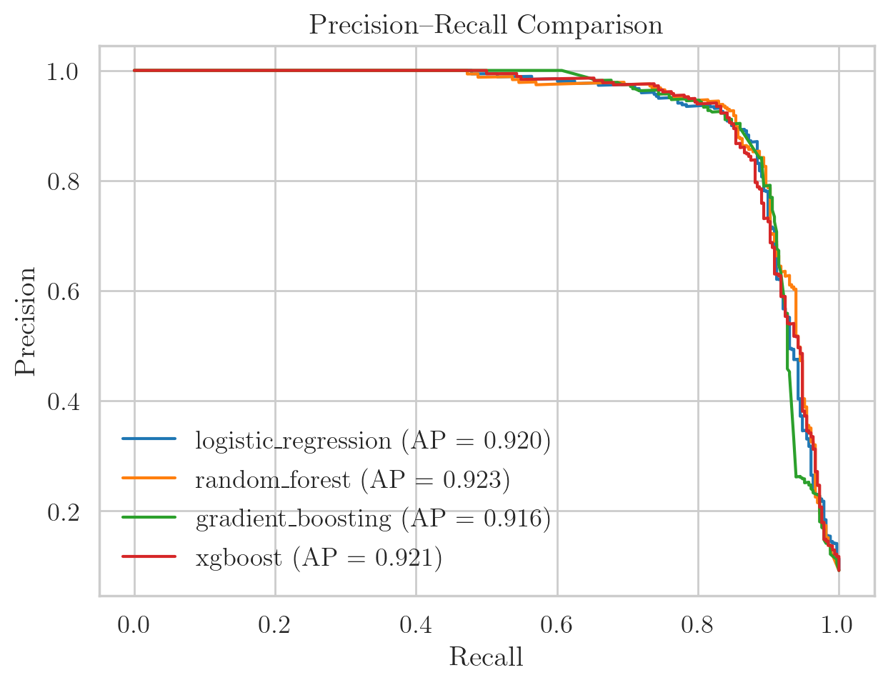
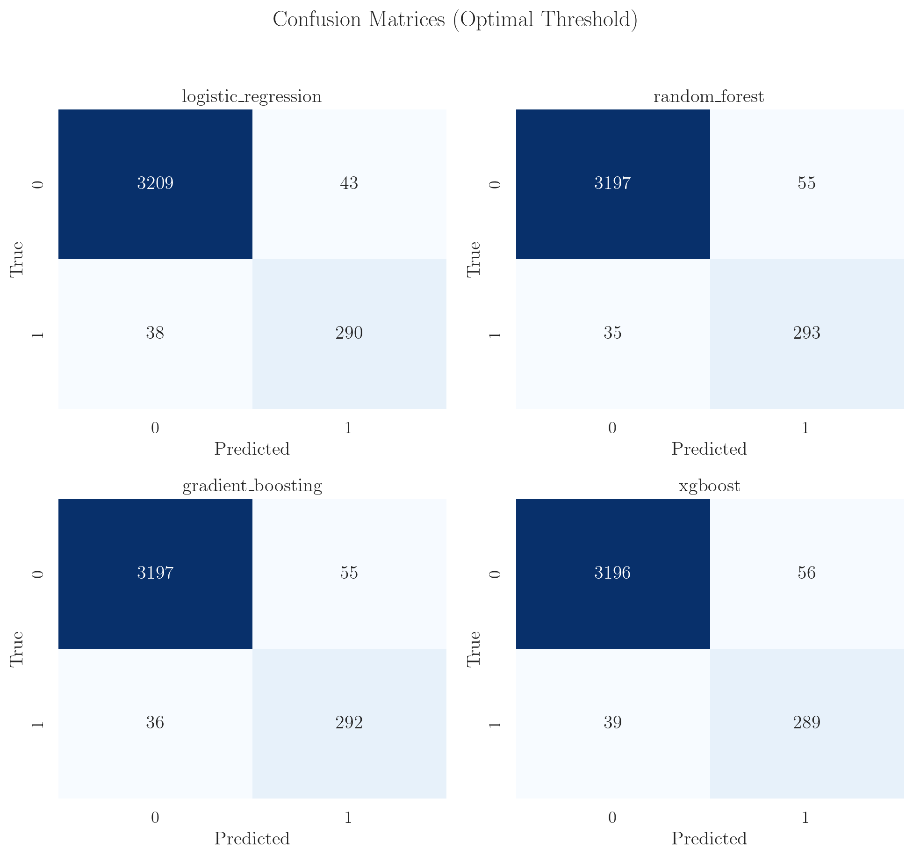

# 📈 Model Performance

## Validation Performance Summary

| Model               | Best CV score | Val ROC–AUC | Val F₂  | Val F₁  | Val Recall | Val Precision |
|---------------------|--------------:|------------:|--------:|--------:|-----------:|--------------:|
| **Random Forest**   | **0.8894**    | 0.9724      | **0.8825** | 0.8669 | **0.8933** | 0.8420 |
| Gradient Boosting   | 0.8876        | 0.9672      | 0.8800 | 0.8652 | 0.8902 | 0.8415 |
| XGBoost             | 0.8850        | 0.9733      | 0.8721 | 0.8588 | 0.8811 | 0.8377 |
| Logistic Regression | 0.8507        | **0.9736**  | 0.8815 | **0.8775** | 0.8841 | **0.8709** |



**Key observations:**

- All models achieve **high ROC–AUC (~0.97)**, indicating that the HTRU2 dataset is
  relatively easy to separate with the engineered features.
- **Random Forest** achieves the **highest validation F₂-score (0.8825)** and was
  selected as the final model, in line with the recall-oriented objective (catching
  as many pulsars as possible).
- Tree-based models (Random Forest, Gradient Boosting, XGBoost) have **very similar
  performance**, which suggests that the gains between them are marginal compared to
  the choice of features and decision threshold.



## Final Test Performance (Selected Random Forest)

After selecting Random Forest, the model was retrained on the full training data and
evaluated on the held-out test set.

- **Optimal threshold**: 0.362
- **F₂-score**: 0.8923
- **F₁-score**: 0.8819
- **Recall**: 0.8994
- **Precision**: 0.8651
- **ROC–AUC**: 0.9747
- **PR–AUC**: 0.9306

These numbers confirm that the model maintains high recall on unseen data while
keeping false positives under control.

## Confusion Matrix (Random Forest – Test Set)

```text
[[3206   46]   # True Negatives | False Positives
 [  33  295]]  # False Negatives | True Positives
```
